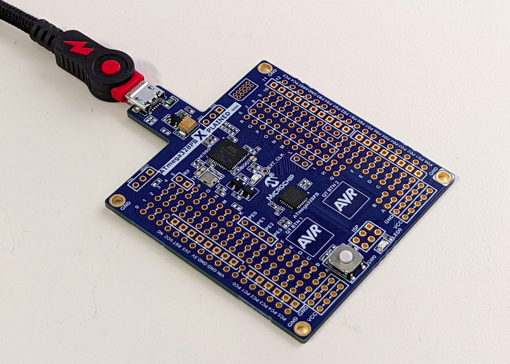

# libnklabs example for 8-bit AVR microcontrollers

This repository holds an example application for
[libnklabs](https://github.com/nklabs/libnklabs) that runs on 8-bit AVR
processors.

The main challenge with AVR is the limited amount of RAM coupled with the
fact that string constants are by default stored in RAM.  They are stored
there by default because AVR provides a separate address space for flash
memory.  Flash memory numeric addresses overlap with RAM addresses (so the
number alone can not be used to distinguish between the spaces), and in any
case special methods must be used to access data from flash.

String constants can be forced into flash by marking them with the
__\_\_flash__ storage class in avr-gcc.  All pointers to such string
constants must also be adorned with this storage class.  A special macro,
__PSTR()__, must be used to surround string literals if they are to be
placed in flash.

libnklabs automatically puts printf format strings and help text into flash. 
This is mostly hidden to the user, since nk_printf is implemented as a macro
which invokes PSTR() on the format string.

Unfortunately, this breaks gcc's format string type checking (so directives
in format strings are not type checked).

Also, there are now two nk_printf directives for strings: use %s if the
string is located in RAM, or %S if the string is located in flash.

A good source of C programming on AVR is here:

[https://www.nongnu.org/avr-libc/user-manual/FAQ.html](https://www.nongnu.org/avr-libc/user-manual/FAQ.html)

For now, these chips are supported:

## ATmega32

The target is an ATmega32 located in an STK500 development board.  We have
been using the Atmel ICE instead of the STK500 to program the chip.  Atmel
ICE seems to work more reliably with "avrdude" (the open source programming
tool).

ATmega32 has 32KB of flash and 2KB of RAM.  This is enough to run the
libnklabs CLI.

### Oscillator

New, unprogrammed ATmega32s use a built-in 1 MHz oscillator by default.

For the serial port to work, the lower fuse byte should be changed from 0xE1
to 0xE0 so that it will instead use the STK500 supplied clock.  This clock
is 3686400 Hz ("3.68 MHz" from the documentation), which is an integer
multiple of 115200 baud.

This fuse byte can be programmed with

	make -f Makefile.atmega32 fuse

### UART pins

PD0 and PD1 are the UART Tx and Rx lines.  These should be connected to the
RXD and TXD pins so that the "RS232 SPARE" DB9 connector of the STK500 can
be used to access the libnklabs CLI.  See the photo above.

## ATmega328pb

The target is an ATmega328pb located on a ATmega328PB Xplained Mini
development board.  This board is programmed with the on-board mEDBG.

[https://www.microchip.com/en-us/development-tool/atmega328pb-xmini](https://www.microchip.com/en-us/development-tool/atmega328pb-xmini)

ATmega328PB has 32KB of flash memory and 2KB of RAM.

### Oscillator

By default the ATmega328pb on the Xplained Mini board is programmed to use
the 16 MHz clock from the mEDBG.

### UART pins

The UART is connected to the virtual com port of the mEDBG.

## Build instructions

### Prerequisites

Install the compiler and the debugger interface:

	sudo apt-get install avrdude
	sudo apt-get install avr-gcc

Note that avr-gcc has support for ATmega328P, but not ATmega328PB.  See:

[https://stuvel.eu/post/2021-04-27-atmega328pb-on-gcc/](https://stuvel.eu/post/2021-04-27-atmega328pb-on-gcc/)

But compiling with ATmega328P works since ATmega328PB is upward compatible.

Install "picocom" to connect your terminal emulator to a USB serial port:

	sudo apt-get install picocom
	sudo apt-get install lrzsz

### Disable Modem Manager

The USB to serial adapter typically provided on embedded debuggers shows up
in Linux as a modem.  The Linux modem manager will try to talk to it (you'll
see ATxx commands being sent to the MCU after you connect with picocom).  To
prevent this:

	sudo systemctl disable ModemManager.service

Alternatively, you can try this (if you need the modem manager): It did not
work on the ATSAMD21 Xplained Pro board, but did on the others.  Modify the
file /lib/systemd/system/ModemManager.service

        [Unit]
        Description=Modem Manager

        [Service]
        Type=dbus
        BusName=org.freedesktop.ModemManager1
        ExecStart=/usr/sbin/ModemManager --filter-policy=default   <-- Change from strict to default
        StandardError=null
        Restart=on-abort
        CapabilityBoundingSet=CAP_SYS_ADMIN
        ProtectSystem=true
        ProtectHome=true
        PrivateTmp=true
        RestrictAddressFamilies=AF_NETLINK AF_UNIX
        NoNewPrivileges=true
        User=root
        Environment="MM_FILTER_RULE_TTY_ACM_INTERFACE=0"     <-- Add this line

        [Install]
        WantedBy=multi-user.target
        Alias=dbus-org.freedesktop.ModemManager1.service

Then:

        systemctl daemon-reload
        systemctl ModemManager.service

### Building

Build the software with:

	make -f Makefile.atmega32

or

	make -f Makefile.atmega328p

Program the chip using Atmel ICE:

	make -f Makefile.atmega32 flash

or using mEDBG:

	make -f Makefile.atmega328p flash

## CLI

The libnklabs CLI should appead on the serial port:

Use 115200 baud for the ATmega32.

Use 38400 baud for the ATmega328pb.  The baud is limited in order to get an
accurate rate using an integer divider from the 16 MHz clock.

~~~~
[Initialize] Work queue
[Initialize] Command Line Interface
[Initialize] Begin main loop
>
>help
help <name> for help with a specific command

Available commands:

echo                      Control command echoing
help                      Help command
info                      Display serial number and firmware information
mcuflash                  Read/write flash memory
mem                       Read/write memory
power                     Show/control power mode
reboot                    Reboot system
work                      Show work queue
>info
Firmware version 0.4
Build date: 2022-08-03 13:38
Git hash: a88da22ae4336ac59483831a738ba7cdf47f9ca7-dirty
Target platform: NK_PLATFORM_AVR
Memory footprint:
  sizeof(bool) = 1
  sizeof(char) = 1
  sizeof(short) = 2
  sizeof(int) = 2
  sizeof(long) = 4
  sizeof(long long) = 8
  sizeof(void *) = 2
>
>mem hd 0
0000: 82 00 00 00 fc 00 00 00  00 74 00 01 00 00 00 00  .........t......
0010: 00 00 00 00 01 00 00 07  00 00 00 01 ab 07 1e 00  ................
0020: 00 f8 fe ff 00 00 00 00  30 01 98 60 30 00 00 4b  ........0..`0..K
0030: ff 00 00 c3 00 00 ff 00  00 ff 00 00 00 00 73 03  ..............s.
0040: 00 00 00 1c 13 0d 00 00  00 00 00 00 00 00 00 00  ................
0050: 00 c0 00 00 00 00 00 00  00 80 00 00 00 ab 07 82  ................
0060: 66 00 74 00 74 00 00 00  00 00 00 00 00 00 00 00  f.t.t...........
0070: 00 00 01 00 00 00 00 00  00 00 00 00 00 00 09 0f  ................
0080: 01 00 90 01 01 01 0d 09  b2 27 5a 04 7a 20 53 06  .........'Z.z S.
0090: 1e 26 fc 12 1e 29 15 08  d3 26 44 02 76 0c c2 07  .&...)...&D.v...
00a0: 02 28 d9 02 ba 0d 3e 00  00 00 00 15 00 00 00 15  .(....>.........
00b0: 00 00 00 0d 68 65 6c 70  0d 69 6e 66 6f 0d 0d 6d  ....help.info..m
00c0: 65 6d 20 68 64 20 30 0d  00 00 00 00 00 00 00 00  em hd 0.........
00d0: 00 00 00 00 00 00 00 00  00 00 00 00 00 00 00 00  ................
00e0: 00 00 00 00 00 00 00 00  00 00 00 00 00 00 00 00  ................
00f0: 00 00 00 00 00 00 00 00  00 00 00 00 00 00 00 00  ................
>
~~~~
